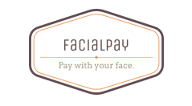

# Summary
FacialPay is a face recognition based payment system for point of sale terminals. The goal is to eventually replace credit cards with biometrics (like face, retinal and/or fingerprint scan).

The `backend` folder contains all the backend code for face recognition and the implementation of the database system for payments. The `frontend` folder contains the code for the UI that allows POS payment.

# Pitch
Suppose you go out for a run early in the morning without your wallet and cellphone. For some reason or another, you need to buy a product from one of your favorite stores. My service enables banking systems to use facial recognition as a means of payment, enabling you to go cashless and cardless.

# What it does
It uses deep neural networks in the back end to detect faces at point of sale terminals and match them with those stored in the banking systems database and lets the customer purchase a product from a verified seller almost instantaneously. In addition, it allows a bill to be divided between customers using recognition of multiple faces. It works in a very non-invasive manner and makes life easier for everyone.

# How I built it
I used dlib as the deep learning framework for face detection and recognition, along with Flask for the web API and plain JS on the front end. The front end uses AJAX to communicate with the back end server. All requests are encrypted using SSL.

# Challenges I ran into
I attempted to incorporate gesture recognition into the service, but it would cause delays in the transaction due to extensive training/inference based on hand features. This is a feature to be developed in the future, and has the potential to distinguish and popularize my unique service.

# What's next for FacialPay
I plan on associating this service with bank accounts from institutions such as Scotiabank. This will allow users to also see their bank balance after payment, and help me expand my project to include facial recognition ATMs, gesture detection, and voice-enabled payment/ATMs for them to be more accessible and secure for Scotiabank's clients.
